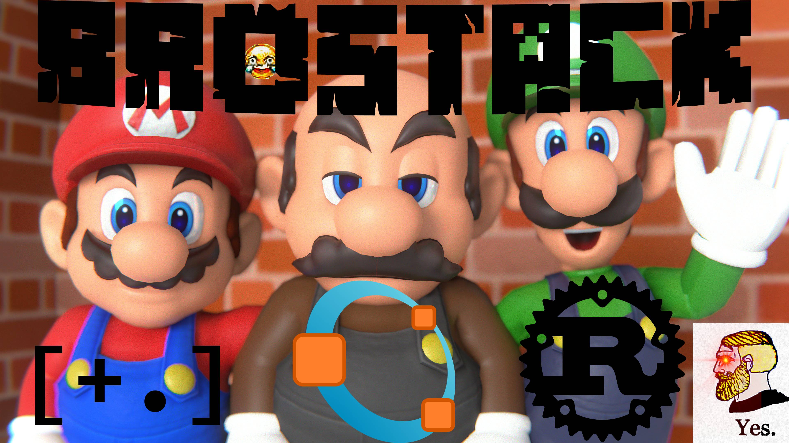

# BROstack

> BROstack? More like BROken stack! I'm pretty sure that combination is only used by masochists who enjoy torturing themselves. But hey, at least you're not a basic C++ user, am I right?
>
> ~ [roastedby.ai](https://www.roastedby.ai)

## Demo

### Brainfuck

### Rust

### Octave
